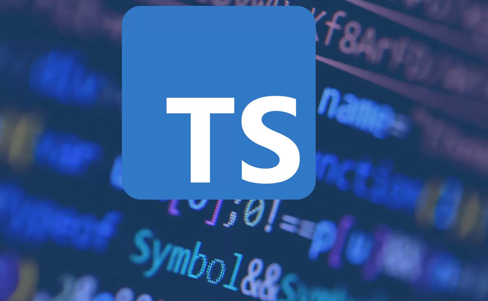

## Introduction

Prior to this class I learned different languages over the years, like learning C, C++, JavaScript, HTML, and Python. With some of the languages that I learned, I don't like Python, but I like other programming languages like C and C++ since they're somewhat similar. Since starting ICS 314, we are required to type code in TypeScript, and I think this is the worst language that I have learned so far. TypeScript is a superset of JavaScript, but TypeScript adds static systems to help catch errors. Since this language is like JavaScript but this can catch errors early, I think it's a better version of JavaScript, but I think it's more aggravating for me to code in compared to other languages.

## How I feel about TypeScript

My feelings for TypeScript are mixed at the moment since I just learned this language, but it's a bit more annoying to implement than other coding languages. I think TypeScript is a good programming language from a software engineering perspective since it's faster since it can catch errors faster than other languages like JavaScript. I think the use of TypeScript can be more useful in bigger projects since it can catch any error fast compared to JavaScript, which is slow to catch errors. However, I think if we use TypeScript for small projects, it's less efficient since it's less useful to use. With doing practice WODs, I learned that it was quite difficult for me to code in TypeScript, but I coded my WODs in JavaScript and copied and pasted it in TypeScript. But over time, when learning more about TypeScript, I think I can determine if I like TypeScript or I hate it. 

## Comparison to Different Languages

Comparing TypeScript to different languages that I learned over the years, however, this language puts a huge workload on me since I am a little rusty in JavaScript, so my TypeScript is also bad. But I am good at coding in C and C++, but compared to TypeScript, it is a higher-level programming language and stricter than C and C++. Another language that I can compare it to is Python with TypeScript; it feels more structured since it's an object-oriented and functional program. JavaScript and TypeScript are similar since they share very similar syntax, but TypeScript adds static typing, which is more useful with projects and team collaborations. TypeScript combines all of the previous languages that I learned with many differences, with it being a more maintainable system. 

## What I learned about ES6

Since I previously learned JavaScript, it was easier for me to understand ES6. This will improve the readability and efficiency of using both TypeScript and JavaScript with variables like "let" and "const," with these already being used in both JavaScript and TypeScript. With being used in both of the languages, it helps me recognize more TypeScript. Using ES6 helps me write more modern-style and less error-prone code. I think if I put time into learning more about ES6 and its rules, it will help me understand the strictness of TypeScript so I'm not overwhelmed.

## Overall Conclusion 

I think at the end of this course I can understand more and become a proper athletic software engineer with help using WODS. I think practicing the previous class WODs helps tremendously since it's almost the same ideal way of completing the WODs, and it helps me see how I can improve my WOD time and shows me experience of working under time. I think this type of teaching style is very different since I am used to in-person talks about the class slides and not reading at home before coming to class-type lectures. To me, this makes things more stressful since I don't usually have that much free time to do things. But it's somewhat enjoyable since we can go at whatever pace of learning that we want, and this kind of works for me since I can stack a whole section one at a time and get things over with already.
