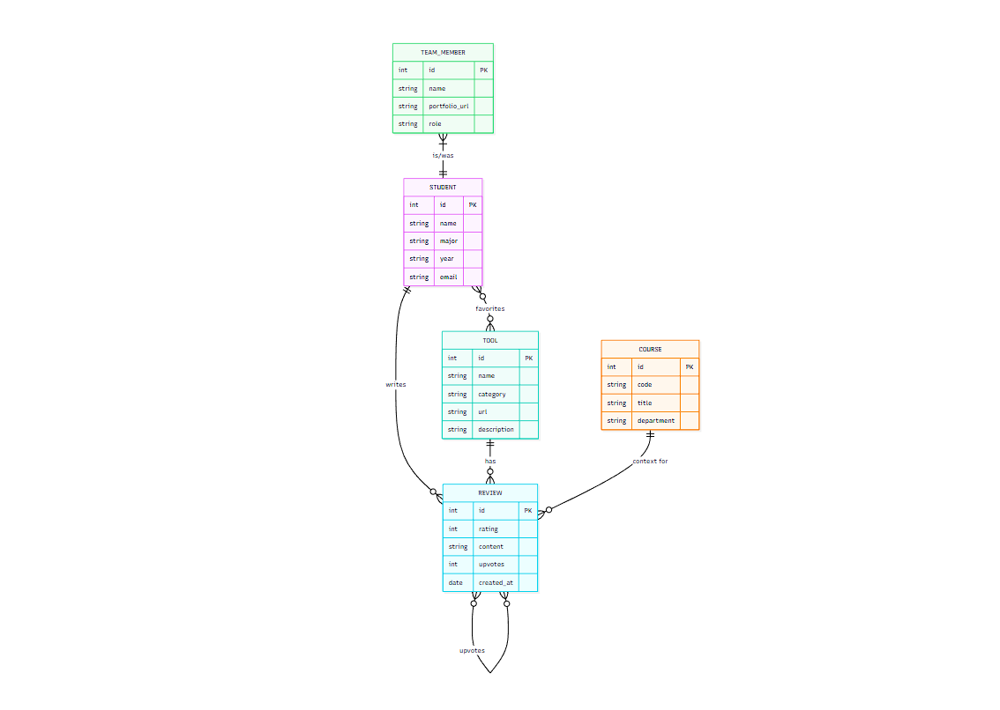

## Introduction

When people imagine building a web app, they often picture typing out features one by one, like stacking blocks until a site appears. But real software, especially something meant for thousands of students, needs more than pieces placed together. It needs structure, rules, and blueprints just like a growing city. This is where design patterns come in: they are the architectural logic behind software, the reusable solutions that make a system stable even as new features, pages, or interactions pile on. I didn’t fully understand how important these patterns were until my team built our final project, RateMyTools, a student driven platform for reviewing online learning tools. What looked like simple pages and forms on the surface quietly depended on deep, well established design patterns underneath.

## The Idea of Designing Software

Design patterns are the “city planning” of code. They aren’t copy and paste code snippets, but reusable ways to solve common problems how to create objects, how to organize data, how to manage user flow, or how to simplify connections between components. Just like every city reuses basic designs for roads, bridges, and neighborhoods, software reuses proven solutions like Controllers, Factories, Adapters, and Observers. These patterns keep the entire system from falling apart as it grows. Without them, even a small app becomes unpredictable, with files depending on each other in messy ways. With them, code becomes modular, expandable, and understandable—not only to the person who wrote it, but to anyone who joins the project later. They are the quiet backbone that holds every modern application upright.

## Relations to Final Project

As we built RateMyTools, our app quickly began to feel less like a school assignment and more like a small digital city that needed real structure. Each feature searching for tools, opening profile pages, submitting reviews, and filtering by course had to move through a predictable flow to keep everything from breaking. Without even realizing it at first, we ended up relying on design patterns to organize the system. The Prisma models defined how data lived in our database, the React components controlled what users saw, and the API routes handled all the actions between them. This natural separation mirrored the organization that design patterns provide. React’s state system also helped different parts of the UI react instantly when users typed or clicked, which kept the app feeling alive and responsive. In building this project, I started to see how design patterns quietly keep everything in order so a complex system can grow without turning chaotic.

##  Design Patterns that Help our App 

Several design patterns worked behind the scenes in RateMyTools, even if we didn’t consciously name them during development. The Factory Pattern appeared whenever Prisma created new entry tools, reviews, or users, letting us generate objects without worrying about the construction details. The app’s structure followed MVC, with Prisma models handling data, React components displaying the UI, and API routes acting as controllers. On the front end, React’s automatic re-rendering reflected the Observer Pattern, since components reacted to changes in state whenever users searched, filtered, or submitted reviews. Prisma also relied on the Singleton Pattern, maintaining one shared database connection for the entire app. And our database interactions followed the Repository Pattern, keeping queries clean and separate from UI logic. Together, these patterns made the system organized, scalable, and much easier to maintain.

## Overall Conclusion 

Looking back, design patterns were not just academic ideas. They were the invisible city planning that kept RateMyTools from becoming a confusing mess of random scripts and unpredictable behavior. They helped us divide work across team members, kept our database organized, and made the interface feel responsive and consistent. But there were also some flaws in our process. When someone finished early, we still had to wait for the rest of the group to finish their sections before the assignment could be completed. We also did not consider how different schedules and responsibilities affect teamwork. Even though there were time constraints and challenges, understanding and using design patterns made our project stronger and gave us a better idea of how real software development works.
