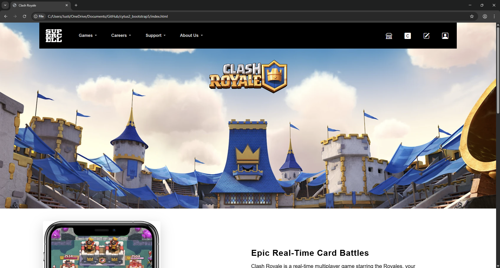

## Introduction

The User Interface (UI) frameworks are essential tools in modern web development. It can seem almost as complex to learn as a new programming language. Since frameworks like Bootstrap 5 offer substantial benefits, they can make them worth the effort to implement. With these frameworks, it can help provide structures, speed, and maintainability, which allows the developers to create a professional and very responsive website. 

## Structure and Consistency

The main advantage of the use of UI frameworks is that they help provide structure and consistency. With Bootstrap 5 as an example, it offers a 12-column grid system that makes building responsive layouts straightforward. Developers can ensure that the pages look polished on both mobile and desktop without the complex media lines in the style. CSS class. With the additionally prebuilt components that are inside Bootstrap, like buttons, forms, and navigation bars, which create a unified look across the website, it also reduces the chances of styling inconsistencies. 

## Speed and Efficiency 

With the UI frameworks, it will also save significant development time. Instead of writing repetitive CSS for common elements, the developers can use prebuilt classes and components. This is particularly helpful for features like the modals, carousels, or responsive menus. From my experience, using Bootstrap 5 took far less time to implement than previous projects and coding entirely in HTML and CSS. With the documentation and utility classes, I was allowed to quickly implement features while maintaining the design's flexibility, which also proved that the frameworks can help increase productivity. 

## Maintainability and Scalability 

Another benefit of using frameworks is improved maintainability and scalability. Websites built with a consistent framework are easier to update and expand, especially when implementing the code with other group members in a team project. New developers can quickly understand the structure because the frameworks can enforce common patterns and conventions. Moreover, frameworks like Bootstrap are supported by large communities, meaning updates, bug fixes, and accessibility with improvements are regularly provided. This makes the frameworks a reliable foundation for long-term web projects. 

## Conclusion

While UI frameworks may have a steep learning curve, their advantages in structure, speed, and maintainability make them a worthwhile investment. Raw HTML and CSS are valuable for learning fundamentals, but frameworks like Bootstrap 5 allow developers to create responsive, professional, and scalable websites efficiently. For any modern web project, the time spent mastering a UI framework pays off in both quality and productivity.
