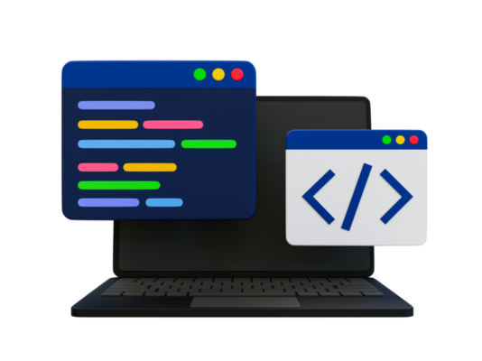

*Why I am interested in Software Engineering*

The reason I am interested in pursuing software engineering is because of an experience I had back in intermediate school. That was the first time I was introduced to coding through programs like Scratch, where I was able to make simple games. It was also around this time that I became hooked on playing video games, which made me curious about how they were created. Unfortunately, I didn’t have a good enough computer or the knowledge to go deeper into coding at the time. Later on, I also developed an interest in engineering, especially in areas like CAD and building things in general. Because of this, I asked my brother, who is now a mechanical engineer at Ampere Computing, about jobs that combine coding and engineering. He recommended software engineering, since it involves both programming and problem-solving with an engineering mindset. That conversation helped inspire me to pursue a degree in software engineering, as it connects my early interest in coding with my passion for engineering and creating things.

## Learning more skills

I hope that over time, I will continue to strengthen my skills by becoming more familiar with different programming languages and applying them to new challenges. Throughout college, being exposed to various languages has taught me how important it is to adapt, practice, and keep learning. These experiences have not only helped me build a foundation in coding but have also shown me the value of problem-solving and persistence. To keep improving, I plan to take on more projects that allow me to practice and apply what I have learned, while also pushing myself to explore new tools and concepts. By continually building and refining my skills, I will be better prepared for future opportunities and more confident in my ability to grow as a software engineer.

## Getting experience

From what I’ve observed around campus, there are many events that give students opportunities to learn and connect. For example, this week there was a meeting about technology and how companies use AI here in Hawaii. Attending events like these is a great way to gain exposure, meet new people, and start building connections. By talking to company representatives and making friends with others who share the same interests, I can work toward getting an internship or even a part-time job with one of these companies. Another valuable way to gain experience is through hands-on learning, such as working on projects or joining a coding club, which can help strengthen technical skills and provide real-world practice. 

## Career Goals

My main career goal after college is to pursue a job on the mainland, since there are more opportunities available there. Another goal I want to accomplish is to live independently while working hard to establish myself and earn a good standing at the company I work for. I also want to continue gaining new programming knowledge that will help me grow in my career while building new connections that can open future opportunities. One long-term goal I hope to achieve is starting my own company, even though it may feel far-fetched right now. Lastly, I want to help my parents move from Hawaii to Oregon so they can enjoy and retire. 

## Growth in class

In class, I want to gain new knowledge of TypeScript and work toward becoming a strong and adaptable software engineer. I also want to practice working under time limits and pressure through the WODs, since they help prepare me for real-world situations. Another goal is to rely less on AI and focus more on strengthening my own problem-solving skills, while also improving my understanding of programming concepts and functional programming idioms. At the same time, I want to learn how to use AI more effectively as a supportive tool rather than a replacement for my own learning.
