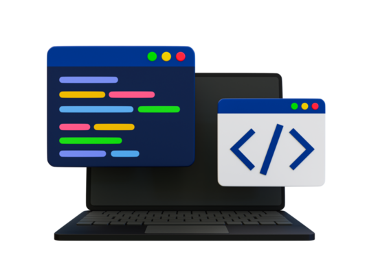

*Why I am interested in Software Engineering*

The reason I am interested in pursuing software engineering is because of an experience I had back in intermediate school. That was the first time I was introduced to coding through programs like Scratch, where I was able to make simple games. It was also around this time that I became hooked on playing video games, which made me curious about how they were created. Unfortunately, I didn’t have a good enough computer or the knowledge to go deeper into coding at the time. Later on, I also developed an interest in engineering, especially in areas like CAD and building things in general. Because of this, I asked my brother, who is now a mechanical engineer at Ampere Computing, about jobs that combine coding and engineering. He recommended software engineering, since it involves both programming and problem-solving with an engineering mindset. That conversation helped inspire me to pursue a degree in software engineering, as it connects my early interest in coding with my passion for engineering and creating things.

## Learning more skills

I hope that over time, I will continue to strengthen my skills by becoming more familiar with different programming languages and applying them to new challenges. Throughout college, being exposed to various languages has taught me how important it is to adapt, practice, and keep learning. These experiences have not only helped me build a foundation in coding but have also shown me the value of problem-solving and persistence. To keep improving, I plan to take on more projects that allow me to practice and apply what I have learned, while also pushing myself to explore new tools and concepts. By continually building and refining my skills, I will be better prepared for future opportunities and more confident in my ability to grow as a software engineer.

## Getting experience

Ever hear people ragging on engineering companies for delivering late and way over budget? Well, some engineering jobs are really difficult, especially if the requirements and funding are undulating underneath you. Because of the nature of the problem, sometimes engineering firms require large amounts of engineers and workers, inviting further problems and delays.

The Honolulu Rail project at home has become this sort of poster child of failure, budget overrun and overall incompetence in Hawaii. Well, working though regulatory boards and fiscal procedures in Hawaii seems like it's a mind bogglingly difficult job to do. Granted, there might be some fishy stuff going on, but I refuse to believe that everyone is involved for nefarious reasons.

The problem of creating an unprecedented public transportation backbone on an island is difficult! I'm not sure we would have done it right, even if the best people were involved.

## Career Goals

So in the end, we realize that all engineering and programming is there for a reason - to serve human needs. Maybe that's why those things are difficult, because they both involve humans and are for humans.

Relationships, regardless if they're romantic or not take work. Humans are fickle creatures and relationships can come and go with the wind. To properly maintain something over time requires work. Family takes work. Marriage takes work. We live to figure out what works and what doesn't and hope that as we move forward we're improving.

Relationships have always been difficult, and by nature will continue to be so.

## Growth in class

So back to the original premise; why is being one of the club officers so difficult?

And the final answer - it's supposed to be difficult, and it's supposed to challenge you, just like everything else that humans do that is difficult: programming, engineering, engaging in relationships, pondering the universe, etc.

Ultimately the question you should really ask yourself if something if particularly difficult is then "is it worth it"? That is something that is context specific and only you can answer yourself.
