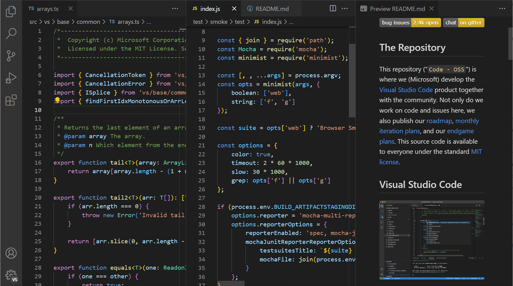

## Introduction

Communication is really important in becoming a software engineer, so try to communicate with other people. With asking someone like a teacher or an employer so the software engineer can ask questions or ask for help to integrate their code into an application. The article “Eric Raymond’s How to Ask Questions the Smart Way” has long been regarded as a blueprint for interactions within an open-source community. By asking very informative questions, this can help a software engineer get a precise question for the employer to reply to. Rather than asking a less informative question, this can lead to more misinformation for the software engineer and the communicator. 

## StackOverflow Questions

StackOverflow will provide a good real-world system with the use of Raymond's principles. One example is the use of dividing and producing a rounding error. With a response of a snippet of something from a programming language like Python 3, also provide a small snippet of code with this, and describe how the code works and the unexpected outputs. This follows Raymond's advice; with this kind of response, it will show if the person has prior research of the code that they implemented. However, in StackOverflow there are many poor examples of the questions that are often quickly closed; for example, someone's Java loop is not working. What can someone do with a vague description and no context, with a poor question?

## Example of a Smart Question

With this example of a Smart Question in StackOverflow, is this [Smart Question](https://stackoverflow.com/questions/11227809/why-is-processing-a-sorted-array-faster-than-processing-an-unsorted-array). With this question the asker is clearly provided the context, including the complete code in the language for which this asker is asking a question in C++ code, with them also adding a snippet that demonstrates the observed difference in performance between processing the sorted and the unsorted array. By including this code and a measurable result, this helps the asker and allows other people to respond to the question, with this being a key principle in Eric Raymond's book. With this question being upvoted the highest, a lot of people responded and communicated with the question that he had. With a lot of people being engaged with this question, there were replies to his question. With the help of the community, the asker got to see the best responses to the question that they asked. 

## Example of Not a Smart Question

With this example of not a Smart Question in StackOverflow, is this [Not Smart Question](https://stackoverflow.com/questions/44013965/java-main-function-wont-compile-with-a-method-in-it). In contrast to the previous question, this pitfall of a poorly asked question with the post lacks the sufficient context and detail of what the asker is trying to convey. But the asker provided a code snippet, but they didn't put the exact error in the message received or the expected behavior. Also, withthe title being vague, it is very unclear what specific compilation issue is being encountered. With the asker not showing any attempts to troubleshoot the problem or describe any steps they have taken to try to resolve the issue that they have. With this response being downvoted a lot since there was not a lot of information or context about what issue that they had. So the people had to guess what the issue was and how they could fix it by themselves, so there was no reason for people trying to answer the not-smart question.

## Conclusion 

With asking very smart questions is very important since 
