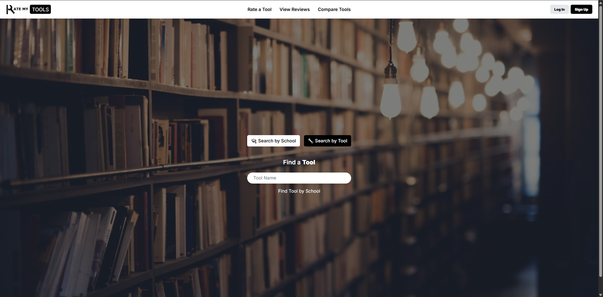
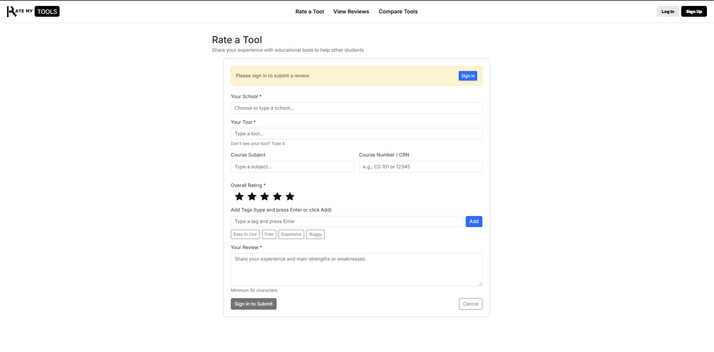

# Overview 

The project I worked on with other people was to create a web application that allows students to rate learning tools used in their classes and see how those ratings compare with other students’ opinions across different schools. The application is connected to a backend system that collects rating data and displays it on a review page, where users can see total reviews for each tool. Users can also rate reviews using a thumbs-up or thumbs-down system to indicate whether a review was helpful. The application includes a comparison feature that allows users to compare ratings between different learning tools. There is a login restriction where users must be signed in to rate a tool, but they do not need to be signed in to rate whether a review was helpful or not. Lastly, the application includes a search engine that allows users to search for a specific tool to see its overall rating and which schools use it. Users can also search by school to see which tools were rated as helpful there.

# My Contribution 

My contributions to this project included creating the rate page and the review page of the application. Since I was mainly responsible for the rating portion of the project, I also implemented the review page so that information from the rate page would automatically link and appear in the review section. I additionally contributed to the rating system for the review section, designing it to help users understand how trustworthy a tool and its ratings were. After completing these features, I worked on testing and integrating them with other parts of the application to make sure everything functioned correctly alongside the features developed by other group members.

# What I Learned

There were many things that I learned from this project. One of the main lessons was how to work together with other people using GitHub, especially when collaborating on shared code and resolving changes. I also learned the importance of time management, particularly working toward deadlines and trying to complete tasks within a limited time frame. Another important skill I gained was experience setting up and implementing Vercel for deployment and using a Neon database for the backend. While the technical experience was valuable, working with other people was also challenging at times. Some tasks were not completed by the time group members said they would be, which made coordination more difficult and taught me the importance of communication and flexibility in team projects.

# GitHub Links

[RateMyTool Application](https://rate-my-tools-sc.vercel.app/)

[RateMyTool Organization](https://ratemytool.github.io/RateMyToolPage/)
