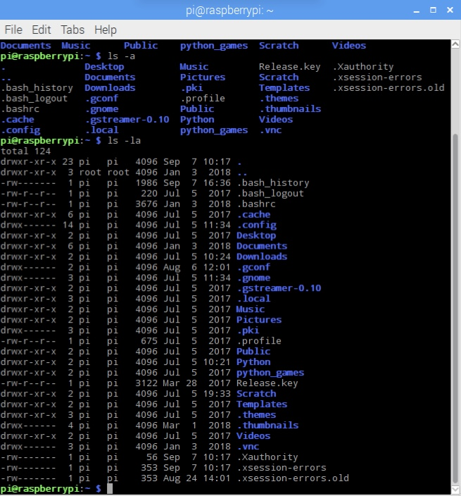

<div class="text-center p-4">
  
</div>

The purpose of this ICS 212 project was to demonstrate our ability to write code in both C and C++, as well as to program in UH Unix, including the use of g++ and makefiles. This project spanned the entire course, building upon the previous homework assignments. Initially, we implemented the Bank UI to handle credit card numbers, addresses, search for a specific card and address, print all information, and delete records. Later, we converted the program from C to C++, maintaining all previous functionalities. Additionally, the C++ version introduces the use of pointers for data handling and a debug mode menu for easier testing and verification.


Here is some code from that project:

```cpp
void getAccountNum(int &accountno)
{
    while (true)
    {
        cout << "Enter account number: ";
        if (cin >> accountno && accountno > 0)
        {
            cin.ignore(100, '\n'); 
            break;
        }
        else
        {
            cout << "Invalid input. Please enter a positive intger." << endl;
            cin.clear( );
            cin.ignore(1000, '\n');
        }

    }
}
 

void getName(char name[ ], int size)
{
    bool valid = false;
    while (!valid)
    {
        cout << "Enter name: ";
        cin.getline(name, size);
        
        if (strlen(name) == 0)
        {
            cout << "Please enter a name. " << endl;
        } 
        else
        {
            valid = false;
            for (int i = 0; name[i] != '\0'; i++)
            {
                if (isalpha(name[i])) 
                {
                     valid = true;
                     break; 
                }
            }
         
            if (!valid)
            {
                cout << "Name must contains a letter. " << endl;
            }
        }
    }
}
```
