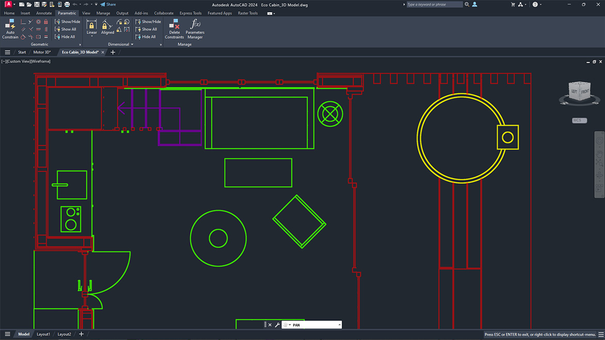

<div class="text-center p-4">
  
</div>

For this project, I designed a 3D-printed brace that fits around the drill bit of a Computer Numerical Control (CNC) machine. The brace is designed to hold a laser at the (0,0) position, or the center of the machine bed, aligned with the material. I used RhinoCAD to design the brace and then imported the design into the 3D printer’s software to prepare it for printing with using PLA material.

```
