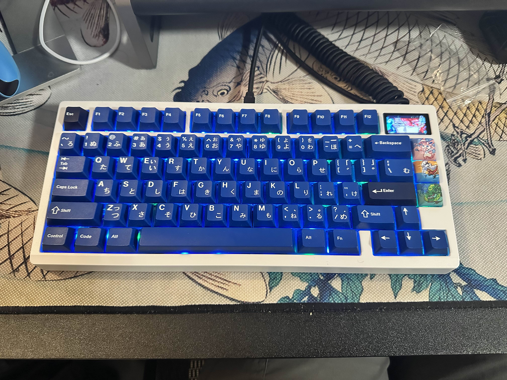

  

For this project, I assembled a Zoom75 barebones keyboard kit by following the manual and troubleshooting the wiring to ensure full functionality. I also installed a small LCD screen inside the keyboard by replacing one of the original badges. Prior to assembly, I pre-lubricated the switches to improve sound and typing feel. After setup, I customized the LCD screen to display different visuals.

Materials Used:

1) Zoom 75 with a metal plate
  
2) LCD Screen

3) Zoom 75 Polycarbonate Plate

4) Lubricated Everglide Aqua King switches
   
5) Lubricated DK Cookies and Cream switches
    
6) GMK Striker 2.0 Keycap set
